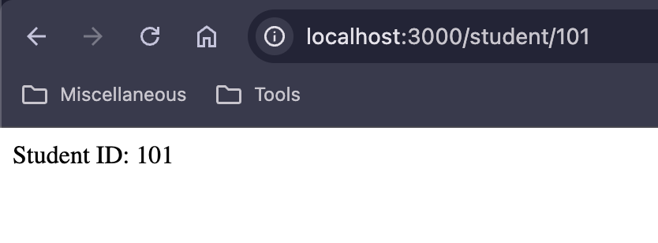
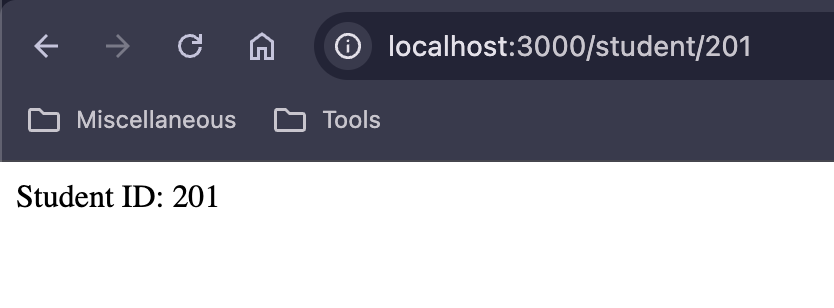
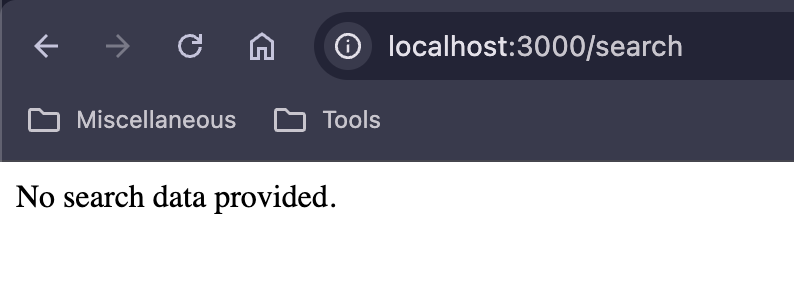

# ExpressLab

## Express.js Route and Query Parameter Assignments

This repository contains three practical assignments based on **Express.js routing**, **route parameters**, and **query parameters**.

The assignments demonstrate how to create dynamic routes and retrieve data from URLs using `req.params` and `req.query`.

---

## Project Structure

```text
Express_Routing/
│
├── Assignment_1/
│   ├── app.js
│   └── Screenshots/
│       ├── 1.png
│       └── 2.png
│
├── Assignment_2/
│   ├── app.js
│   └── Screenshots/
│       ├── 1.png
│       └── 2.png
│
└── Assignment_3/
    ├── app.js
    └── Screenshots/
        └── 1.png
```

## Screenshots

### Assignment 1 — Route Parameters





---

### Assignment 2 — Query Parameters




---

### Assignment 3 — Student Profile

