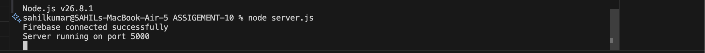
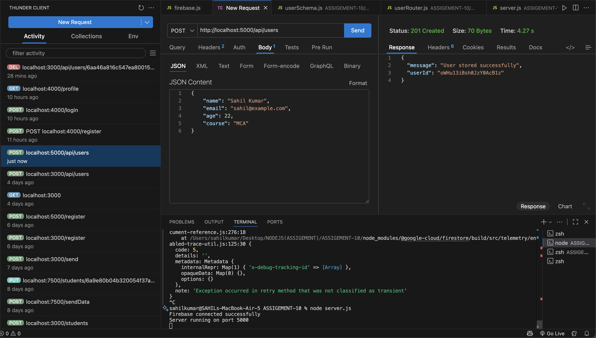
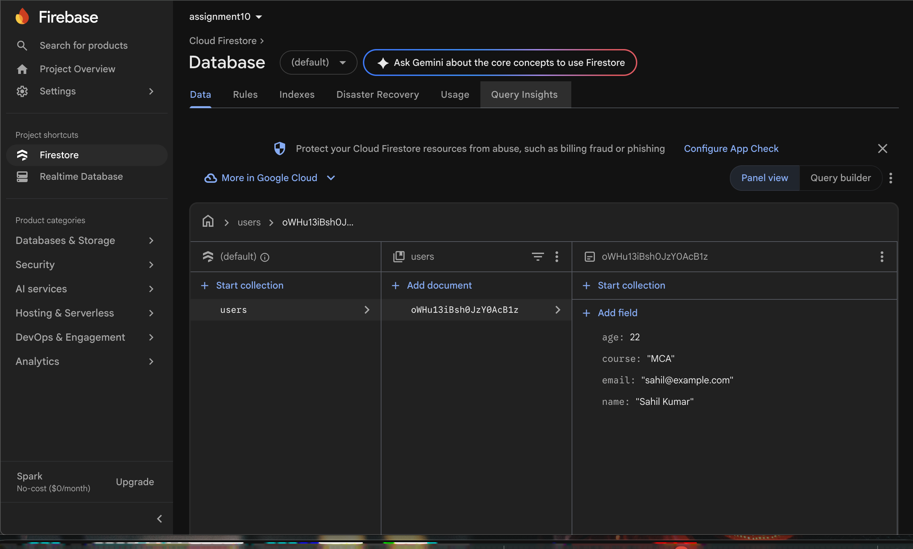
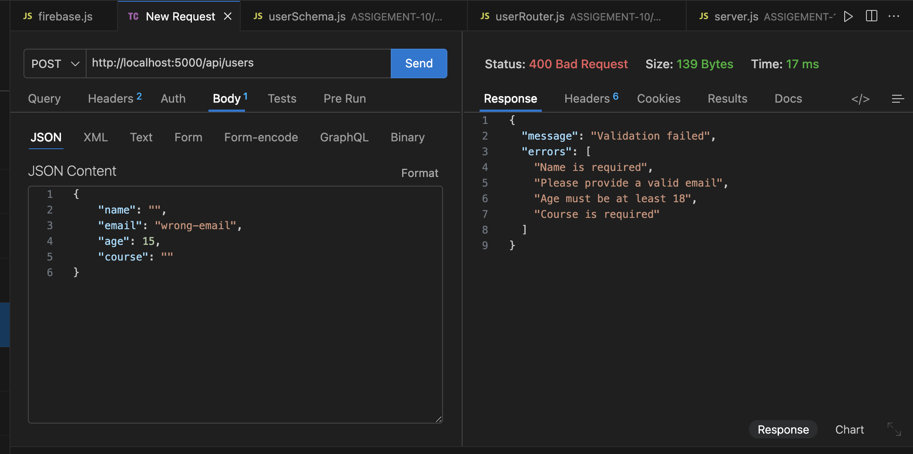

# Express.js Firebase Firestore User API

## Assignment 10

A RESTful backend API built with **Express.js**, **Firebase Admin SDK (Cloud Firestore)**, and **Joi Validation**, following a clean modular architecture.

---

## Objective

The objective of this assignment is to:
- Connect an Express.js backend application to **Google Firebase Firestore** using the **Firebase Admin SDK**.
- Implement schema-based request validation using **Joi** to validate input data before database insertion.
- Build a `POST /api/users` endpoint to store validated user details in the Firestore `users` collection.
- Return appropriate HTTP status codes and structured responses for both success (`201 Created`) and validation failures (`400 Bad Request`).
- Organize the project into dedicated modules: `config/`, `schema/`, and `router/`.
- Test and verify the API using **Thunder Client** and inspect stored documents in the **Firebase Cloud Firestore Console**.


## Project Structure

```text
ASSIGEMENT-10/
├── config/
│   └── firebase.js            # Firebase Admin SDK initialization & Firestore instance
├── router/
│   └── userRouter.js           # POST /api/users endpoint with validation and DB logic
├── schema/
│   └── userSchema.js           # Joi validation schema and custom error messages
├── screenshots/               # API execution and Firebase Console screenshots
│   ├── 1.png                  # Server & Firebase connection startup
│   ├── 2.png                  # Successful POST request in Thunder Client
│   ├── 3.png                  # Data stored in Firebase Firestore console
│   └── 4.png                  # Validation error handling (400 Bad Request)
├── .gitignore                 # Excludes node_modules and service account credentials
├── assignment10-*.json        # Firebase service account private key
├── package.json               # Dependencies and start scripts
├── package-lock.json          # Dependency lockfile
├── server.js                  # Application entry point
└── README.md                  # Project documentation
```


## Request & Response Examples

### 1. Successful User Creation (`201 Created`)

**Request Body:**
```json
{
  "name": "Sahil Kumar",
  "email": "sahil@example.com",
  "age": 22,
  "course": "MCA"
}
```

**Response Body (`201 Created`):**
```json
{
  "message": "User stored successfully",
  "userId": "owHu13iBsh0JzY0AcB1z"
}
```

---

### 2. Validation Failure (`400 Bad Request`)

**Request Body (Invalid Data):**
```json
{
  "name": "",
  "email": "wrong-email",
  "age": 15,
  "course": ""
}
```

**Response Body (`400 Bad Request`):**
```json
{
  "message": "Validation failed",
  "errors": [
    "Name is required",
    "Please provide a valid email",
    "Age must be at least 18",
    "Course is required"
  ]
}
```

---

### 3. Database Server Error (`500 Internal Server Error`)

If Firestore is unreachable or an internal error occurs:
```json
{
  "message": "Database error",
  "error": "<error_message>"
}
```

---

## Request Processing Flow

```text
       Incoming POST /api/users
                  │
                  ▼
         [ Express Router ]
                  │
                  ▼
       [ Joi Schema Validation ]
        ({ abortEarly: false })
                  │
         ┌────────┴────────┐
         │                 │
    (Valid Data)    (Invalid Data)
         │                 │
         ▼                 ▼
   [ Firestore ]     [ 400 Bad Request ]
 (users.add(...))    Returns array of errors
         │
         ▼
  [ 201 Created ]
 Returns doc userId
```

---


## Screenshots

### 1. Successful Firebase Connection and Server Startup
Server initialization on port 5000 confirming successful Firebase connection.



---

### 2. Successful POST Request (Thunder Client)
Thunder Client executing a `POST` request to `/api/users` with valid data, returning `201 Created` with a new `userId`.



---

### 3. Stored Document in Firebase Firestore Console
Firebase Cloud Firestore console verifying the new document saved inside the `users` collection.



---

### 4. Schema Validation Error Handling
Thunder Client testing `POST /api/users` with invalid inputs, returning `400 Bad Request` with specific validation error messages.



---

