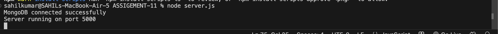
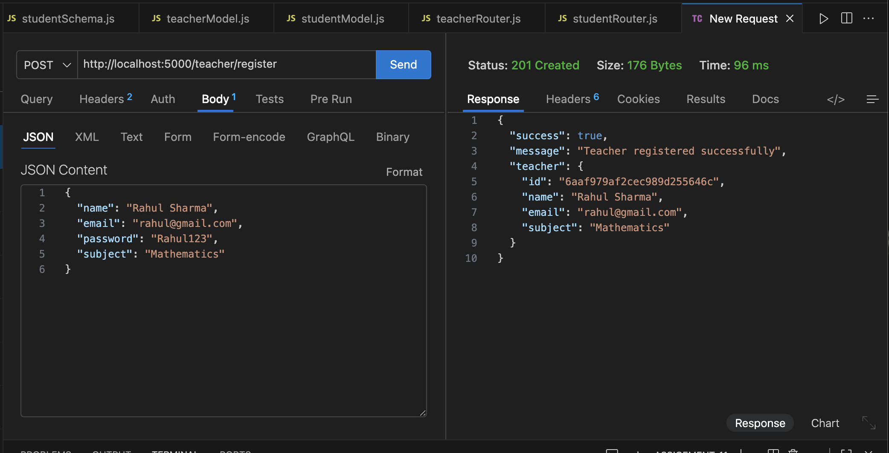
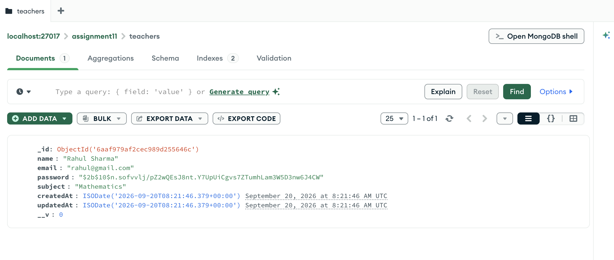
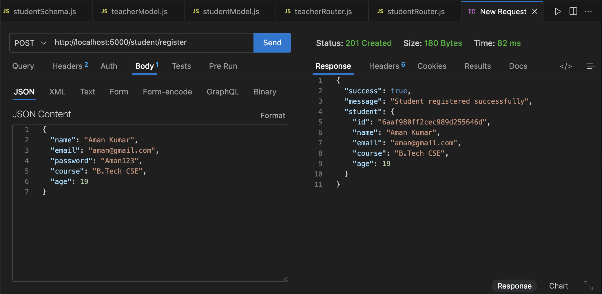
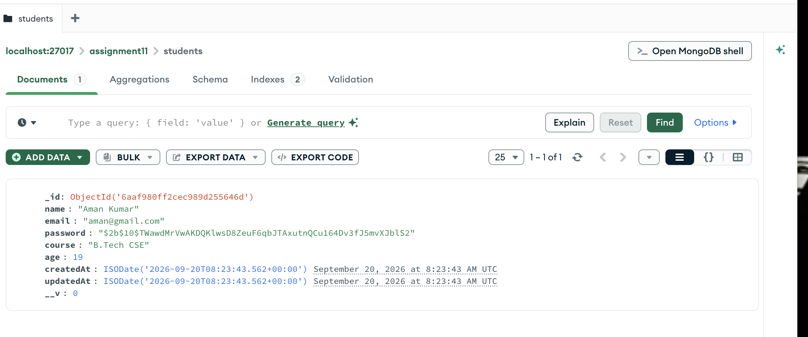

# Teacher and Student Registration API

## Assignment 11

A robust backend REST API built with **Express.js**, **MongoDB**, and **Mongoose**, featuring role-based registration for **Teachers** and **Students** with secure password hashing using **bcrypt** and modular MVC-style architecture.

---

## Objective

The objective of this assignment is to:
- Build an Express.js backend application connected to a local **MongoDB** database using **Mongoose ODM**.
- Create distinct, strongly-typed schemas and models for **Teachers** and **Students**.
- Implement modular routing with separate routers for teacher and student registration endpoints.
- Secure user passwords by hashing them with **bcrypt** (salt rounds = 10) before saving them to the database.
- Store teacher and student records in separate MongoDB collections (`teachers` and `students`).
- Return sanitized response payloads (excluding sensitive hashed passwords) with appropriate HTTP status codes (`201 Created`, `400 Bad Request`, `500 Internal Server Error`).
- Test and verify API endpoints using **Thunder Client / Postman** and inspect stored records in **MongoDB Compass**.


## Technologies Used

- **Runtime Environment:** Node.js
- **Web Framework:** Express.js (`v5.2.1`)
- **Database:** MongoDB (Local instance: `mongodb://127.0.0.1:27017/assignment11`)
- **Object Data Modeling (ODM):** Mongoose (`v9.10.1`)
- **Password Security:** bcrypt (`v6.0.0`)
- **API Testing Tool:** Thunder Client / Postman
- **Database GUI:** MongoDB Compass

---

## Project Structure

```text
ASSIGEMENT-11/
├── model/
│   ├── studentModel.js          # Mongoose model compiled from studentSchema
│   └── teacherModel.js          # Mongoose model compiled from teacherSchema
├── router/
│   ├── studentRouter.js         # Router for POST /student/register
│   └── teacherRouter.js         # Router for POST /teacher/register
├── schema/
│   ├── studentSchema.js         # Validation schema for student data
│   └── teacherSchema.js         # Validation schema for teacher data
├── SCREENSHOTS/                  # Output and verification screenshots
│   ├── 1.png                    # Terminal startup & MongoDB connection
│   ├── 2.png                    # Teacher registration API test
│   ├── 3.png                    # Teacher record & hashed password in MongoDB
│   ├── 4.png                    # Student registration API test
│   └── 5.png                    # Student record & hashed password in MongoDB
├── package.json                 # Project configuration and dependencies
├── package-lock.json            # Locked dependency tree
├── server.js                    # Application entry point & database connection
└── README.md                    # Project documentation
```

---

## Database Schemas & Validation Rules

### 1. Teacher Schema (`schema/teacherSchema.js`)

| Field | Type | Validation Rules | Description |
| :--- | :--- | :--- | :--- |
| **`name`** | `String` | Required, Trimmed, Min `2` characters | Full name of the teacher |
| **`email`** | `String` | Required, Unique, Trimmed, Lowercase, Regex Pattern (`/^[^\s@]+@[^\s@]+\.[^\s@]+$/`) | Unique email address |
| **`password`** | `String` | Required, Min `6` characters (Hashed with bcrypt before storage) | Account password |
| **`subject`** | `String` | Required, Trimmed | Subject taught by the teacher |
| **`timestamps`** | `Date` | Managed automatically by Mongoose | `createdAt` and `updatedAt` |

---

### 2. Student Schema (`schema/studentSchema.js`)

| Field | Type | Validation Rules | Description |
| :--- | :--- | :--- | :--- |
| **`name`** | `String` | Required, Trimmed, Min `2` characters | Full name of the student |
| **`email`** | `String` | Required, Unique, Trimmed, Lowercase, Regex Pattern (`/^[^\s@]+@[^\s@]+\.[^\s@]+$/`) | Unique email address |
| **`password`** | `String` | Required, Min `6` characters (Hashed with bcrypt before storage) | Account password |
| **`course`** | `String` | Required, Trimmed | Enrolled course/degree |
| **`age`** | `Number` | Required, Minimum value `1` | Age of the student |
| **`timestamps`** | `Date` | Managed automatically by Mongoose | `createdAt` and `updatedAt` |


## Screenshots

### 1. MongoDB Connection and Server Startup
Server successfully running on port 5000 with active MongoDB connection.



---

### 2. Teacher Registration – API Request and Response
Thunder Client testing `POST /teacher/register` with teacher details, returning `201 Created` and sanitized user data.



---

### 3. Teacher Record Stored in MongoDB Compass
MongoDB Compass verifying the saved document inside the `teachers` collection with a secure `bcrypt` hashed password.



---

### 4. Student Registration – API Request and Response
Thunder Client testing `POST /student/register` with student details, returning `201 Created` and sanitized user data.



---

### 5. Student Record Stored in MongoDB Compass
MongoDB Compass verifying the saved document inside the `students` collection with a secure `bcrypt` hashed password.



---

## Conclusion

This project successfully fulfills all the requirements of Assignment 11:
1. **Modular Architecture:** Organizes schemas, models, and routes into dedicated directories for maintainability.
2. **Data Modeling:** Establishes distinct Mongoose schemas and collections for `teachers` and `students`.
3. **Password Security:** Hashes passwords with `bcrypt` before database storage to uphold security best practices.
4. **Validation & Error Handling:** Validates incoming payloads and returns appropriate HTTP status codes and feedback.
5. **Database Persistence:** Validated and confirmed via MongoDB Compass.