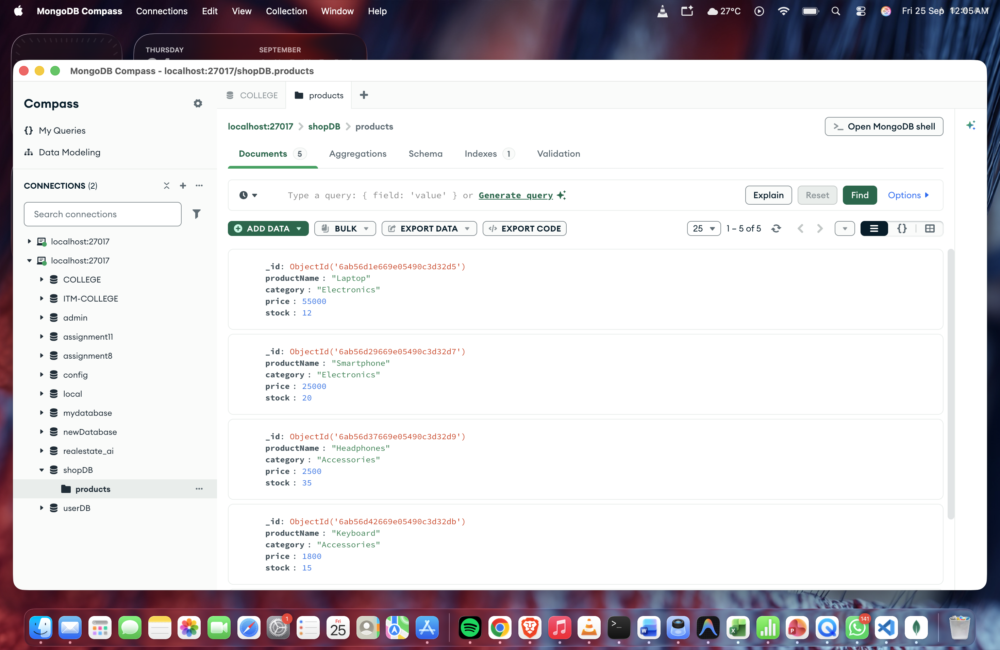
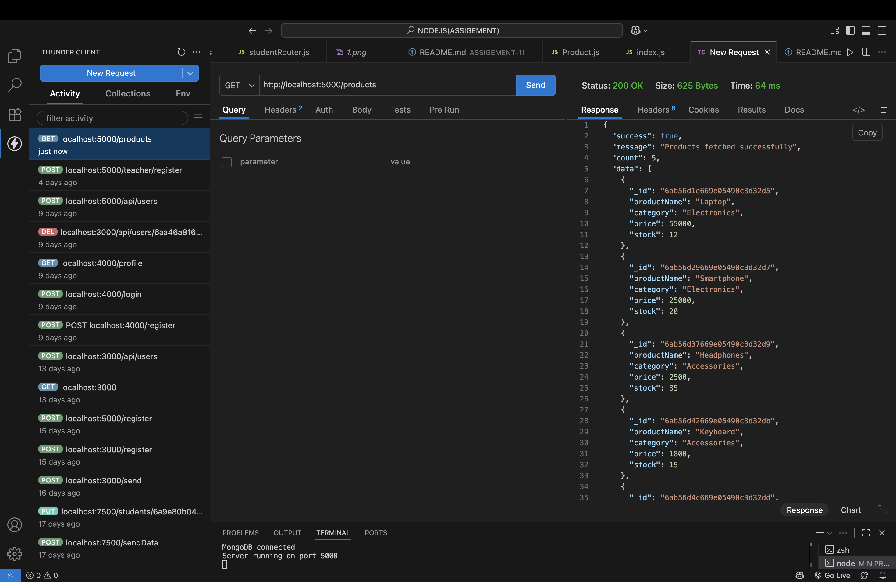
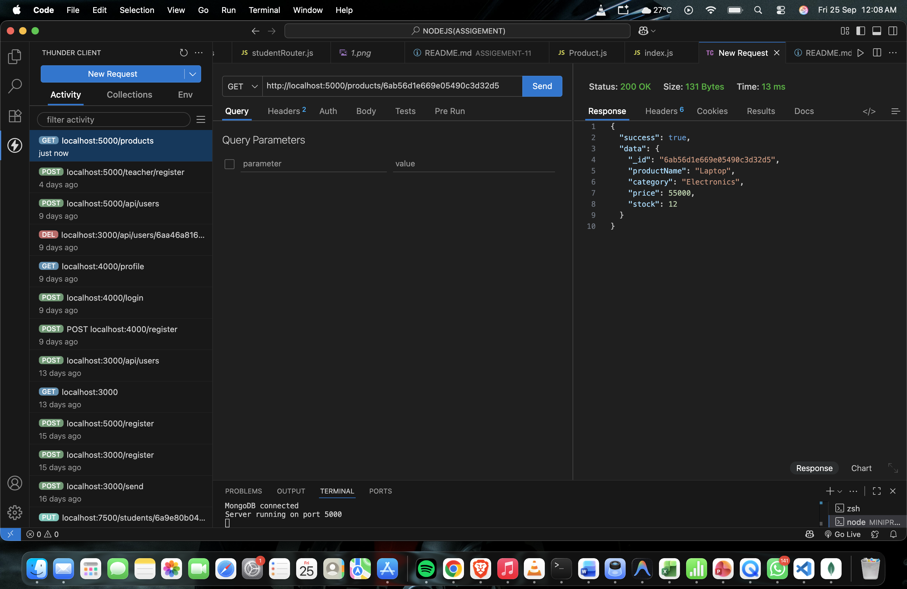
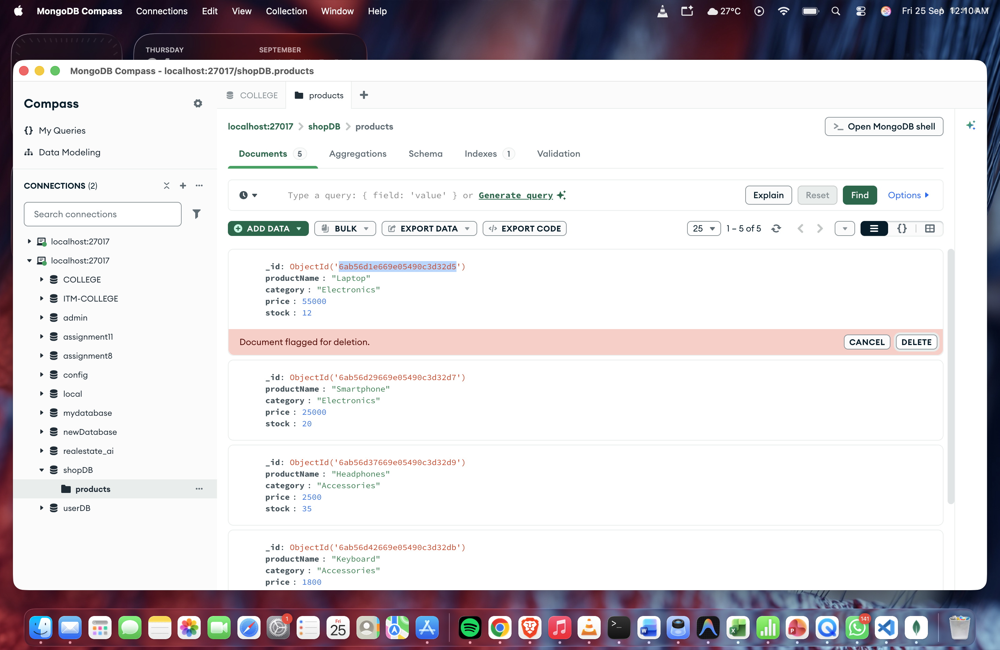
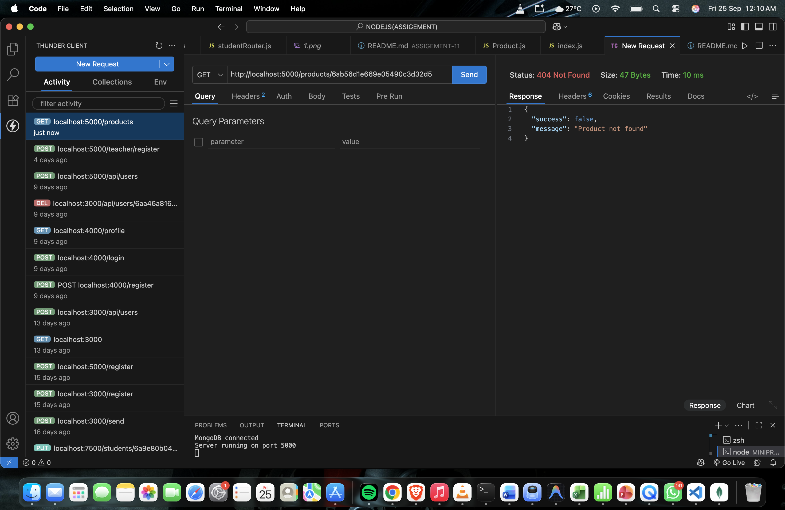

# Product Management REST API

## Mini Project – Q9

A robust backend REST API built with **Express.js**, **MongoDB**, and **Mongoose**, designed to manage and retrieve product catalog records from a MongoDB database. The project demonstrates Mongoose schema design, local MongoDB persistence, RESTful API endpoints, and proper `404 Not Found` error handling.

---

## Objective

The objective of this mini project is to:

- Build an Express.js backend application connected to a local **MongoDB** database instance using **Mongoose ODM**.
- Create a dedicated **Product schema and model** with required and optional validations.
- Store product information inside the `products` collection within the `shopDB` database.
- Manually insert at least five products with varying categories and stock quantities using **MongoDB Compass**.
- Implement an API endpoint (`GET /products`) to retrieve all stored products.
- Implement an API endpoint (`GET /products/:id`) to retrieve a single product using its MongoDB `_id`.
- Implement robust error handling returning HTTP status `404 Not Found` when a product does not exist or has been deleted.
- Test and verify all endpoints using **Thunder Client / Postman**.
- Inspect and verify database records and operations using **MongoDB Compass**.

---

## Technologies Used

- **Runtime Environment:** Node.js
- **Web Framework:** Express.js (`v5.2.1`)
- **Database:** MongoDB (Local instance: `mongodb://127.0.0.1:27017/shopDB`)
- **Object Data Modeling (ODM):** Mongoose (`v9.10.2`)
- **API Testing Tool:** Thunder Client / Postman
- **Database GUI:** MongoDB Compass

---

## Database Configuration

| Setting | Value |
| :--- | :--- |
| **Database Name** | `shopDB` |
| **Collection Name** | `products` |
| **Connection URI** | `mongodb://127.0.0.1:27017/shopDB` |
| **Server Port** | `5000` |

---

## Project Structure

```text
MINIPROJECT/
├── models/
│   └── Product.js                 # Mongoose Product schema and model definition
├── screenshots/                   # Output and verification screenshots
│   ├── 1-mongodb-products.png     # Products stored in MongoDB Compass
│   ├── 2-get-products.png         # Thunder Client: GET /products (200 OK)
│   ├── 3-get-product-by-id.png    # Thunder Client: GET /products/:id (200 OK)
│   ├── 4-product-not-found.png    # Thunder Client: GET /products/:id (404 Not Found)
│   └── 5-delete-product-compass.png # MongoDB Compass: Document flagged for deletion
├── index.js                       # Express app, database connection, and API routes
├── package.json                   # Project dependencies and scripts
├── package-lock.json              # Locked dependency tree
└── README.md                      # Project documentation
```

---

## Product Schema & Data Model

The product data model is defined in `models/Product.js` using Mongoose:

```javascript
const mongoose = require("mongoose");

const productSchema = new mongoose.Schema({
  productName: {
    type: String,
    required: true
  },
  category: {
    type: String,
    required: true
  },
  price: {
    type: Number,
    required: true
  },
  stock: {
    type: Number
  }
});

const Product = mongoose.model("Product", productSchema);

module.exports = Product;
```

### Schema Fields & Validation

| Field | Type | Validation | Description |
| :--- | :--- | :--- | :--- |
| **`productName`** | `String` | Required | Name/Title of the product (e.g., "Laptop", "Smartphone") |
| **`category`** | `String` | Required | Product category (e.g., "Electronics", "Accessories") |
| **`price`** | `Number` | Required | Price of the product in INR |
| **`stock`** | `Number` | Optional | Available inventory stock quantity |

---

## Stored MongoDB Data

Five products were inserted into the `products` collection inside the `shopDB` database using **MongoDB Compass**:

| Product Name | Category | Price (₹) | Stock | MongoDB `_id` |
| :--- | :--- | :--- | :--- | :--- |
| **Laptop** | Electronics | 55,000 | 12 | `6ab56d1e669e05490c3d32d5` |
| **Smartphone** | Electronics | 25,000 | 20 | `6ab56d29669e05490c3d32d7` |
| **Headphones** | Accessories | 2,500 | 35 | `6ab56d37669e05490c3d32d9` |
| **Keyboard** | Accessories | 1,800 | 15 | `6ab56d42669e05490c3d32db` |
| **Monitor** | Electronics | 12,000 | 8 | `6ab56d4c669e05490c3d32dd` |

---

## API Endpoints

### Summary

| Method | Endpoint | Description | Success Code | Error Code |
| :--- | :--- | :--- | :--- | :--- |
| **`GET`** | `/products` | Fetch all products from the database | `200 OK` | `500 Internal Server Error` |
| **`GET`** | `/products/:id` | Fetch a single product by MongoDB `_id` | `200 OK` | `404 Not Found` |

---

### 1. Get All Products

Retrieves all product documents from the `shopDB.products` collection.

- **Method:** `GET`
- **URL:** `http://localhost:5000/products`
- **Response Status:** `200 OK`

**Response Payload:**

```json
{
  "success": true,
  "message": "Products fetched successfully",
  "count": 5,
  "data": [
    {
      "_id": "6ab56d1e669e05490c3d32d5",
      "productName": "Laptop",
      "category": "Electronics",
      "price": 55000,
      "stock": 12
    },
    {
      "_id": "6ab56d29669e05490c3d32d7",
      "productName": "Smartphone",
      "category": "Electronics",
      "price": 25000,
      "stock": 20
    },
    {
      "_id": "6ab56d37669e05490c3d32d9",
      "productName": "Headphones",
      "category": "Accessories",
      "price": 2500,
      "stock": 35
    },
    {
      "_id": "6ab56d42669e05490c3d32db",
      "productName": "Keyboard",
      "category": "Accessories",
      "price": 1800,
      "stock": 15
    },
    {
      "_id": "6ab56d4c669e05490c3d32dd",
      "productName": "Monitor",
      "category": "Electronics",
      "price": 12000,
      "stock": 8
    }
  ]
}
```

---

### 2. Get Product by ID

Retrieves a single product document by its unique MongoDB `_id`.

- **Method:** `GET`
- **URL:** `http://localhost:5000/products/6ab56d1e669e05490c3d32d5`
- **Response Status:** `200 OK`

**Response Payload:**

```json
{
  "success": true,
  "data": {
    "_id": "6ab56d1e669e05490c3d32d5",
    "productName": "Laptop",
    "category": "Electronics",
    "price": 55000,
    "stock": 12
  }
}
```

---

### 3. Product Not Found Handling (404)

If a product does not exist or has been deleted from the database, the API returns a structured `404 Not Found` response.

- **Method:** `GET`
- **URL:** `http://localhost:5000/products/6ab56d1e669e05490c3d32d5`
- **Response Status:** `404 Not Found`

**Response Payload:**

```json
{
  "success": false,
  "message": "Product not found"
}
```

> **Verification Step:** This response was verified by deleting the "Laptop" document (`6ab56d1e669e05490c3d32d5`) from MongoDB Compass and re-sending the `GET /products/:id` request with the same ID.

---

## How to Run the Project

### 1. Install Dependencies

Open a terminal inside the project directory and install the required npm packages:

```bash
npm install
```

### 2. Ensure MongoDB is Running

Make sure the local MongoDB daemon is running on default port `27017`:

```bash
# Verify MongoDB service or open MongoDB Compass and connect to:
mongodb://127.0.0.1:27017
```

### 3. Start the Express Server

Run the application:

```bash
node index.js
```

**Expected Terminal Output:**

```text
MongoDB connected
Server running on port 5000
```

### 4. Test the Endpoints

Use **Thunder Client**, **Postman**, or `curl`:

```bash
# Get all products
curl -X GET http://localhost:5000/products

# Get product by ID
curl -X GET http://localhost:5000/products/<PRODUCT_ID>
```

---

## Screenshots & Verification

### 1. Products Stored in MongoDB Compass
MongoDB Compass confirming all 5 products stored in `shopDB.products` collection.



---

### 2. Fetch All Products (GET /products)
Thunder Client testing `GET http://localhost:5000/products` returning status `200 OK`, count of `5`, and the complete product array.



---

### 3. Fetch Product by ID (GET /products/:id)
Thunder Client testing `GET http://localhost:5000/products/6ab56d1e669e05490c3d32d5` returning status `200 OK` and the specific product document.



---

### 4. Deleting Product in MongoDB Compass
Deleting the product (`6ab56d1e669e05490c3d32d5`) in MongoDB Compass to set up the 404 test scenario.



---

### 5. Product Not Found (404 Error Handling)
Thunder Client re-querying the deleted product ID and receiving the expected `404 Not Found` response with `{"success": false, "message": "Product not found"}`.



---

## Result & Conclusion

The **Product Management REST API** was successfully implemented and validated:

1. **Database Connectivity:** Express.js securely and reliably connects to the local MongoDB database (`shopDB`) via Mongoose.
2. **Data Modeling:** A robust `Product` Mongoose schema and model define strict data types and validation rules.
3. **Data Retrieval:** Endpoints for fetching all products and fetching individual products by MongoDB `_id` operate with appropriate status codes (`200 OK`).
4. **Resilient Error Handling:** Requests for non-existent or deleted IDs gracefully return `404 Not Found` with informative JSON feedback.
5. **Full Verification:** All operations and database state changes were tested and verified using Thunder Client and MongoDB Compass.